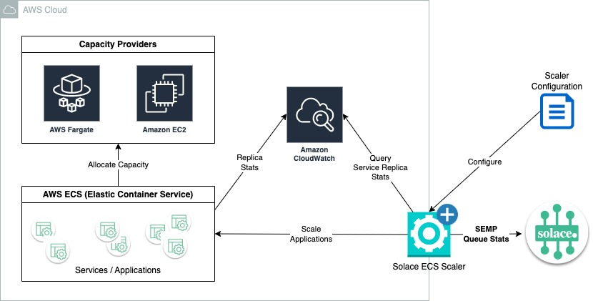

# Readme for Solace ECS Scaler

## Overview

**Solace ECS Scaler** is an app that provides horizontal scaling capability for applications deployed to [AWS Elastic Container Service](https://aws.amazon.com/ecs/) (ECS). The scaler effectively acts like [KEDA](https://keda.sh) does for Kubernetes, but for services deployed to AWS ECS for container orchestration. This scaler is also specific to Solace client consumer applications. It is a Java program that monitors [Solace PubSub+](https://solace.com/products/platform/) queues AND retrieves current/desired replica counts (ECS tasks) from [AWS CloudWatch](https://aws.amazon.com/cloudwatch/). Using this information, the scaler adjusts the target service capacity by setting the number of active replicas based on current demand levels. At present, the Solace ECS Scaler enables scaling based upon **messageCount** (queue backlog) and the **messageReceiveRate**, which is the number of messages received per second average over the last one-minute period.

Similar to KEDA and other scaler apps, it provides the following capabilities:
- The step size can be configured for scale out/in – This is the maximum number of replicas that can be created or destroyed at a time
- There is a unique stabilization window size for each scale out/in – This is the time period of captured past observations that are considered for making scaling decisions
- There is a configurable cooldown period for each scale out/in – This is the number of seconds after a scale out that the system will wait before scaling out again (also applies to scale in)
- The scaler can set targets for queue messageCount, average message receive rate, and message spool size.
- **TBD** - *message spool size scalar target is currently unimplemented*
- **TBD** - Other metrics, such as CPU and Memory, can be extracted from AWS Cloudwatch and used to provided additional metrics for scaling.

## Conceptual Architecture


The Solace ECS Scaler queries both the Solace Broker and ECS Service Task statistics from AWS CloudWatch. Based upon configured metrics, the scaler sets the desired replica count on the ECS service to scale-in and scale-out applications. The scaler connects to Solace Messaging Service, AWS CloudWatch, and AWS ECS Cluster.

### Basic Design
1. Program initiates by reading the configuration file and creating entries in hash maps for each ECS Service/Solace Queue
    - Solace Queue Monitor --> Queries queue statistics from Solace SEMPv2
    - ECS Service Metrics --> Obtains desired and running replica counts from AWS Cloudwatch
    - ECS Service Scaler --> Stores metrics and scaler state for each application
2. Start thread for Solace Queue Monitor - Gather metrics at **pollingInterval** seconds
3. Start thread for Ecs Service Metrics Gathering - Obtains most recent replica counts; runs at fixed interval
4. Allow time for metrics to initialize
5. Start scaling operations on main thread - determines if scaling operations are required; runs at fixed interval

### Scaling Operation
The scaler operation is invoked on a periodic cycle. For each configured service, the metrics configured with positive target values are used to compute a ratio of observed values to the target. The quotient, rounded up, is defines the desired replica scale for the service. If muliple metrics are configured, the maximum value is used.


### Scale Down Compute - Adjustment Factor
There is an Scaling Adjustment factor that is applied for scale down operations. This value is defined in code as `0.9`. The adjustment factor is applied to prevent premature or excessive scale-down operations to mitigate flapping.


# Requirements

- **Basic System**
    - Java 11+
    - Maven (version 3.8+ Recommended)
    - **Optional** Docker Desktop/Engine if using container
- **AWS Environment**
    - ECS Container Insights in AWS Cloudwatch must be enabled. This is necessary to obtain Task/Replica counts.<br>`aws ecs update-cluster-settings --cluster myCICluster --settings name=containerInsights,value=enabled`
    - Access to read statistics from AWS Cloudwatch
    - Access to Update configuration of ECS Services
    - **AWS Access:** AWS Key, Secret, and Region to establish connection and authorization to AWS
- Solace Broker
    - SEMPv2 endpoint for your Solace Broker
    - Basic Auth credentials with access to SEMPv2 monitoring endpoint
    - Application Queues defined as non-exclusive (with or without partitions)

## Limitations
- Current only supports Basic Auth to Solace PubSub+ Brokers; mTLS and other authentication methods are not currently supported
- One instance of the Solace ECS Scaler is required per Solace PubSub+ Service / Message VPN
- One instance of the Solace ECS Scaler is required per AWS Region where ECS services are deployed
- The Solace ECS Scaler can scale applications from 1 to many instances. It cannot scale ECS services to 0 active tasks. This is due to a limitation of ECS container statistics reported to AWS CloudWatch.

# Build & Run

## Build using Maven
Build the Java program using Maven
```bash
mvn clean package
```

## Execute from command line

The following command will execute the scaler. The credentials for AWS must be passed in the environment or using AWS CLI configuration. If you have AWS CLI 2.X installed with your profile configured for AWS Key, Secret, and Region, then your credentials should be picked up automatically. If not, then you need to pass credentials by setting the following environment variables in your command shell:

- `AWS_ACCESS_KEY_ID=YOUR_KEY`
- `AWS_SECRET_ACCESS_KEY=YOUR_SECRET_ACCESS_KEY`
- `AWS_DEFAULT_REGION=YOUR-REGION`

The AWS credentials will be picked up from your environment when the program starts.

```bash
java -jar target/solace-ecs-scaler-1.0.0-jar-with-dependencies.jar --config-file=/path/to/your/config.yaml
```
The `configuration.yaml` file is required. This is where you set Solace Broker connection details, identify queues and services, and specify metric settings. See below for details about the configuration file.

### Disable SSL Hostname Check (NOT RECOMMENDED)

Start the program from a command line with JVM option set to bypass SSL hostname verification.

```bash
java -Djdk.internal.httpclient.disableHostnameVerification=true \
-jar target/java-httpclient-ssl-0.0.1-SNAPSHOT.jar --config-file=/path/to/your/config.yaml
```

## Execute as a Container

There is a `Dockerfile` and additional `buildDockerImage.sh` and `runDockerContainer.sh` to set up an image for the Solace ECS Scaler.

Build the Docker Image:
```bash
./buildDockerImage.sh OPTIONAL_TAG
```

Execute the Docker Image:
```bash
./runDockerContainer.sh /path/to/config.yaml env-file.list OPTIONAL_TAG
```

- The configuration file and the environment file are both required.
- If no tag is specified, then 1.0 is assumed
- The config file should be an absolute path or specified using relative path designator: `./config.yaml`
- The `env-file.list` must contain the environment settings to pass to the container. This is where the AWS credentials  for connections to ECS and Cloudwatch should be passed.

Sample Environment File Contents:
```bash
AWS_ACCESS_KEY_ID=YOUR_KEY
AWS_SECRET_ACCESS_KEY=YOUR_SECRET_ACCESS_KEY
AWS_DEFAULT_REGION=us-east-2
```

# Configuration
Configuration is provided using a file in yaml format. The configuration file is referenced by the application using a command-line argument: `--config-file=path/to/config.yaml`

There are two sections in the configuration file: 
1. `brokerConfig` section to define Solace Broker connection details. There is one broker configurable per Scaler instance.
2. `ecsServiceConfig` section. This section is where the ECS Services, Solace Queues, and metrics are defined. Between 1 and 100 instances are valid.

## Broker Configuration
- **brokerSempUrl** - Broker SEMP REST endpoint including protocol and port
- **username** - SEMPv2 username with access to queue monitoring
- **password** - password for the user name
- **msgVpnName** - Solace PubSub+ Message VPN name
- **pollingInterval** - Time in seconds between calls to SEMPv2 for the lates queue service metrics

## ECS Service Configuration

### ECS Service Deployment
Currently, ECS scaler works for services deployed to the AWS Fargate capacity provider. AWS Fargate is the "serverless" capacity provider for EC2 services: users are not required to provision and configure EC2 servers to handle capacity. The EC2 capacity provider uses a separate scaling sub-system.

### ECS Configuration Parameters
- **ecsCluster** - The ECS Cluster where the service is deployed
- **ecsService** - The ECS service that consumer from the Solace queue identified in the broker configuration and is the target of scaling operations
- **queueName** - The name of the Solace Queue on the Messaging Service

### AWS Credentials
The configured identity must have sufficient access to read the CloudWatch metrics AND to update the ECS Service desired task count. (Task Count is equivalent to Replica Count in this context).
AWS credentials must be configured external to the scaling component. This requirement can be met in one of two ways
1. AWS CLI profile configured Identity using `credentials` and `config` files
2. AWS Identity established with environment variables:
    1. `AWS_ACCESS_KEY_ID`
    2. `AWS_SECRET_ACCESS_KEY`
    3. `AWS_DEFAULT_REGION` or `AWS_REGION`

## Scaler Behavior Configuration

- **minReplicaCount** - The minimum number of tasks allowed.
    - This value can be any integer value greater than or equal to zero.
- **maxReplicaCount** - The maximum number of tasks allowed
    - This value can be any integer value greater than the `minReplicaCount`
    - There is no solid cap on the `maxReplicaCount`, but the value should be set sensibly for the scaled application
- Metrics configuration - At least one of the following must be > 0
    - **messageCountTarget** - Threshold for the average message count per replica
    - **messageReceiveRateTarget** - Threshold for the average message receive rate (per minute) per replica for the scaled application
    - **messageSpoolUsageTarget** - ***Not Implemented*** - Threshold for the average message spool usage per replica for the scaled application
- **scaleOutConfig**, **scaleInConfig** - these sections are optional. If not configured, the assumed values are zeros.
    - **maxScaleStep** - The largest adjustment size permitted in a single scaling operation. If set to zero, then the scaler can adjust ECS tasks to any value within the Min/Max range
    - **cooldownPeriod** - Length of time in seconds before the next scale-out or scale-in operation is permitted.
    - **stabilizationWindow** - Length of time in seconds into the past that metric observations are considered for scaling calculations. The rolling maximum value is selected from this window. If set to zero, then the most recent metric value only is used.

## Example Configuration File

```yaml
---
brokerConfig:
  brokerSempUrl: https://msgsvcabc123.messaging.solace.cloud:943
  username: thisIsMe
  password: secretPassword
  msgVpnName: testVpn
  pollingInterval: 20              # frequency to poll metrics from SEMP in seconds
ecsServiceConfig:
- ecsCluster: ecsCluster1
  ecsService: ecsService1
  queueName: service-queue-1
  scalerBehaviorConfig:
    minReplicaCount: 1             # must be > 0
    maxReplicaCount: 10            # must be > minReplicaCount
    messageCountTarget: 50
    messageReceiveRateTarget: 20
    scaleOutConfig:
      maxScaleStep: 5
      cooldownPeriod: 30
      stabilizationWindow: 10
    scaleInConfig:
      maxScaleStep: 2
      cooldownPeriod: 60
      stabilizationWindow: 120
- ecsCluster: ecsCluster2
  ecsService: ecsService2
  queueName: service-queue-2
  scalerBehaviorConfig:
    minReplicaCount: 1
    maxReplicaCount: 25
    messageCountTarget: 30
    messageReceiveRateTarget: 15
    # scaleOutConfig and scaleInConfig intentionally omitted here;
    # values will default to zeros
- ecsCluster: ecsCluster3
  ecsService: ecsService3
  queueName: service-queue-3
  scalerBehaviorConfig:
    minReplicaCount: 1
    maxReplicaCount: 12
    messageCountTarget: 100
    messageReceiveRateTarget: 30
    scaleOutConfig:
      maxScaleStep: 5
      cooldownPeriod: 30
      stabilizationWindow: 10
    scaleInConfig:
      maxScaleStep: 2
      cooldownPeriod: 60
      stabilizationWindow: 120
```

# Project TO-DO

Also see **TODO** in code comments

- Add Periodic Polling Conigurations; the following are currently hard-coded
    - ECS Metrics Monitor Polling interval
    - Initialization Period is Max of: 60 seconds OR SEMP polling cycle + initial delay
    - Scaling Operation
- Add additional metrics
    - Enable `messageSpoolUsage` metric, currently 1/2 implemented
    - Add CPU and Memory metrics - obtain from EcsServiceMetrics class
- Make scale-down `adjustmentFactor` configurable
- Add error handling logic for SEMP + ECS service calls - currently failures will cause the scaler to exit
- Refactor to use SEMP over message bus - efficiency
- Add mTLS authentication
